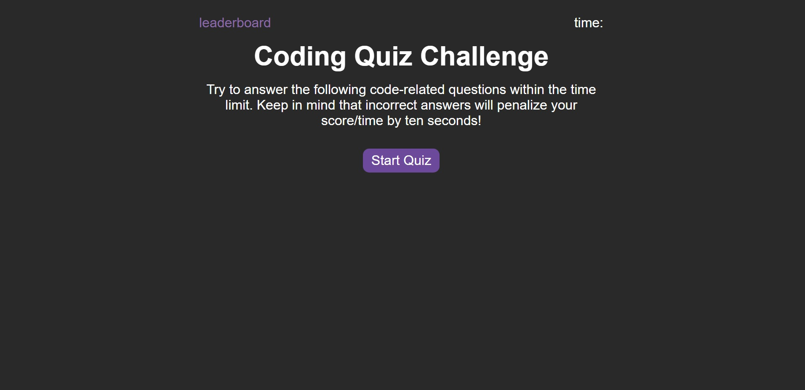

# Module 4 Challenge - JavaScript Quiz

## Description

This is a short quiz game built to test one's knowledge of JavaScript. Users will have 60 seconds to answer as many questions correctly as possible within the time limit and wrong answers will be penalized. Scores can then be saved to the leaderboard using local storage.

## Usage/Preview

Users can start the game by clicking the "Start Quiz" button. This will start the 60-second timer and the first question will be displayed on the screen with four possible answers. Users can click on their best possible guess and the button will turn either green or red depending on whether their choice was correct-- wrong answers will decrease the timer count by 15 seconds. Questions will be displayed like this one by one until there are no more questions left, or the user runs out of time.

After all questions are displayed or the user runs out of time, they will be brought to the end screen where they can enter their name and submit their name and score (time left) to the leaderboard. The leaderboard utilizes local storage to store the user's past attempts. Users will then be presented with buttons to either go back to the main menu or immediately load up another game.

The leaderboard can be accessed in the top-left corner at any time, though accessing it mid-quiz will force users to stop their current attempt.

Live: https://irene-panis.github.io/javascript-quiz/

## Credits

N/A

## License

N/A